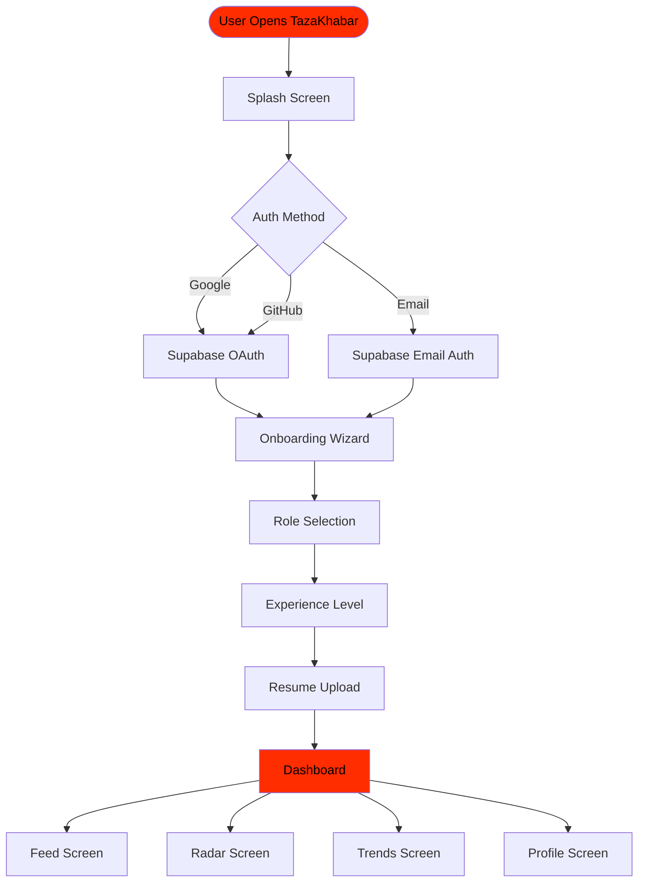
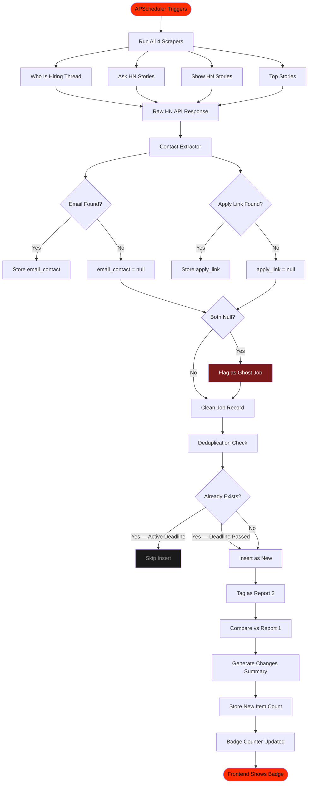
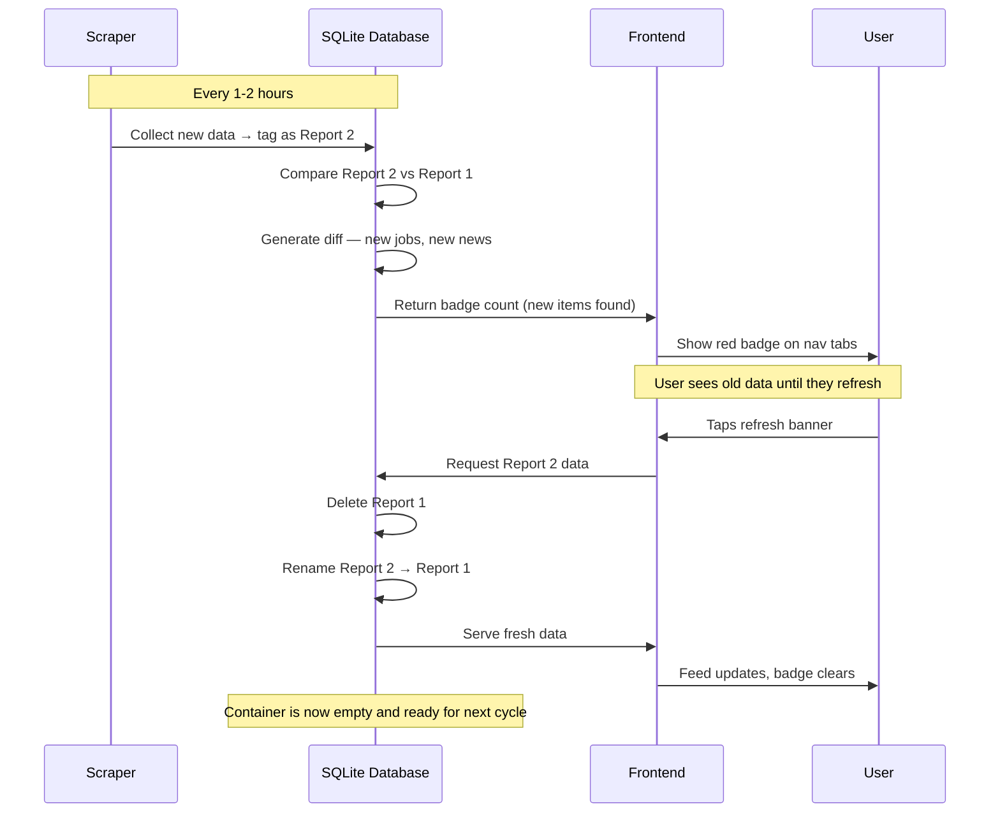
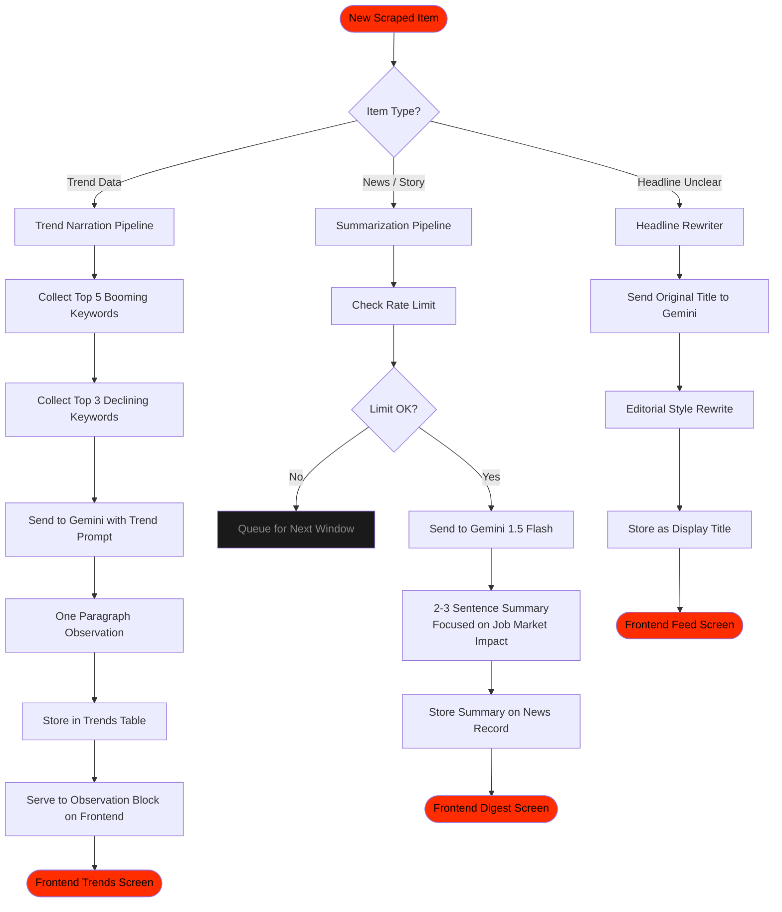
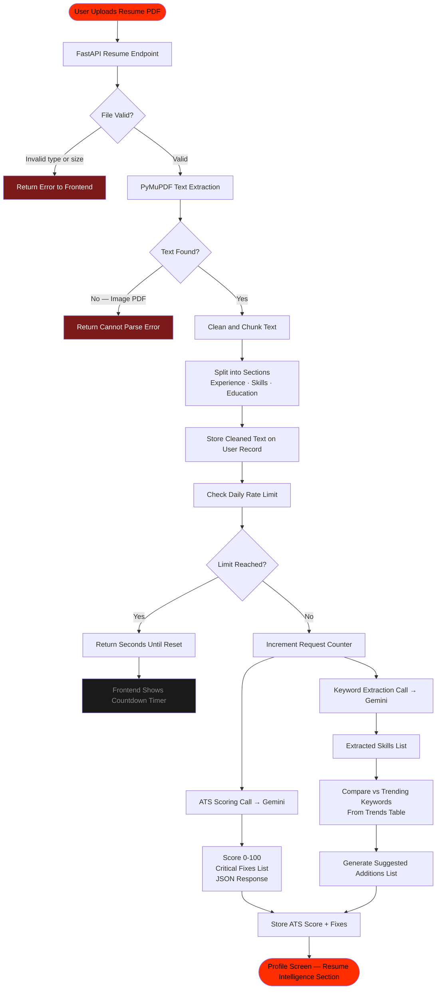
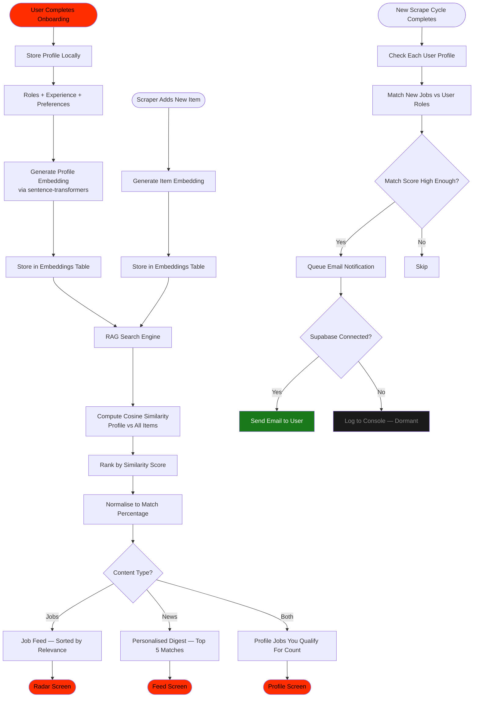
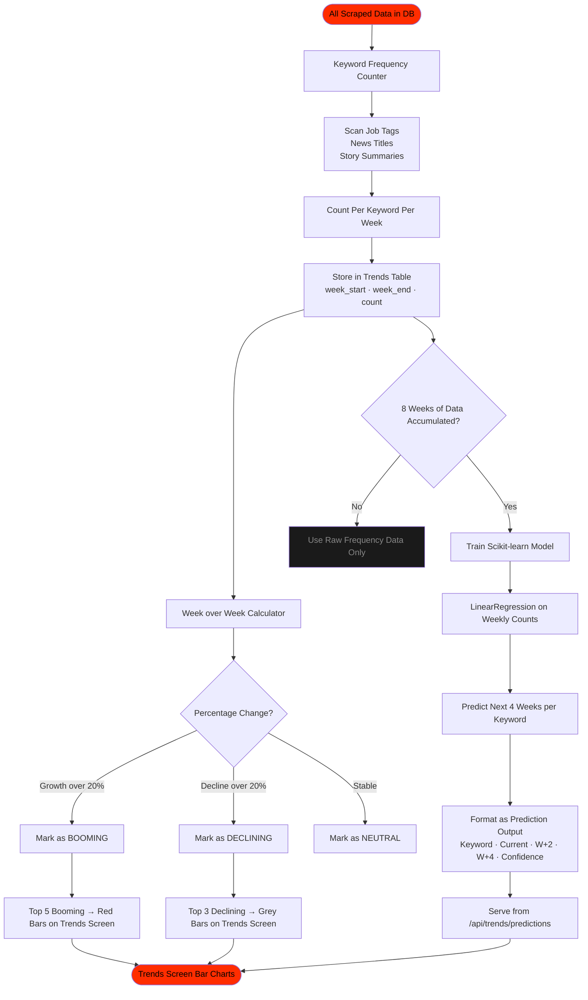
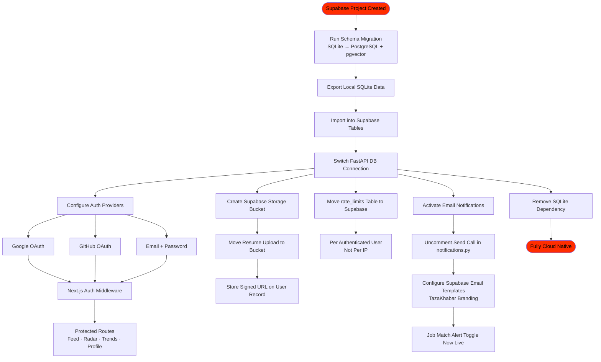
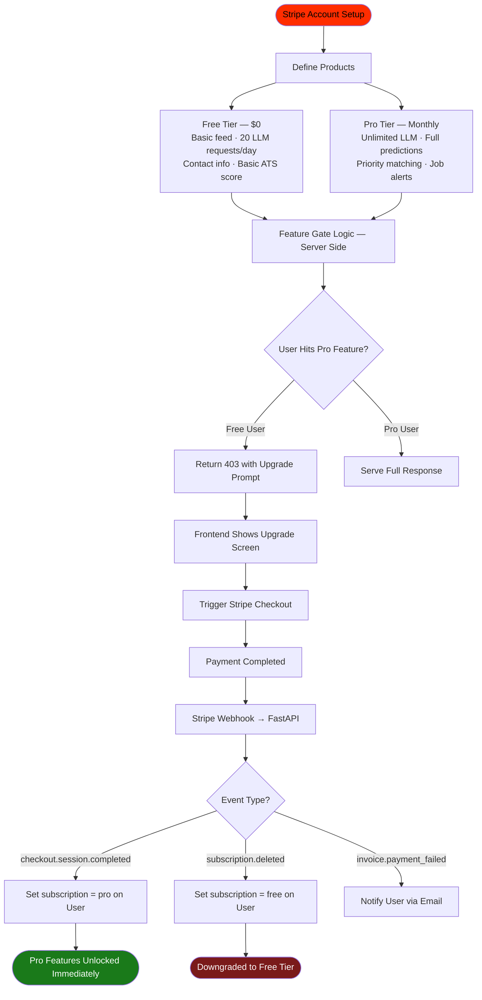
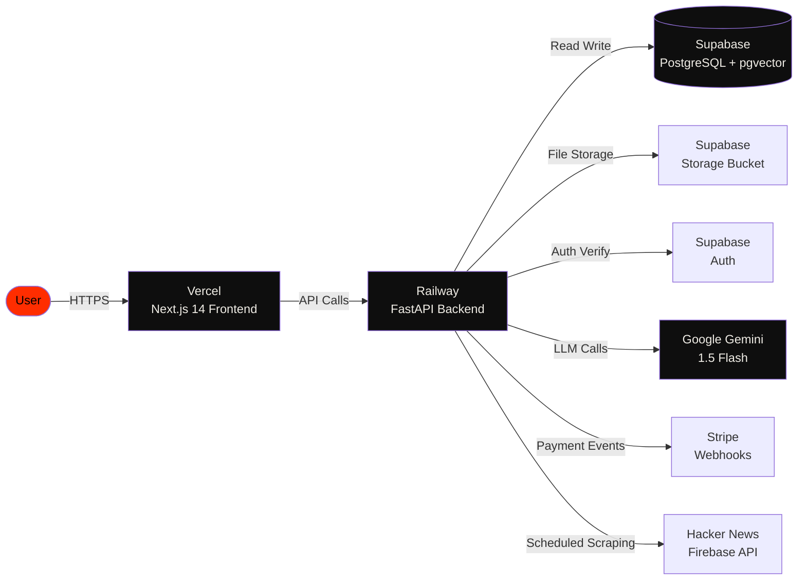

# TazaKhabar


> **Raw intelligence for the tech job market.**
> Real jobs. Real contact info. No ghost listings. No noise.

TazaKhabar scrapes Hacker News in real time, extracts verified job contact information, scores your resume against ATS systems, predicts which tech roles are booming or dying, and delivers a personalised daily digest — all in one brutalist dark interface built for serious tech job seekers.

---

## What It Does

- **Honest Job Hunt** — scrapes HN Who Is Hiring every 2 hours, extracts direct emails and apply links, flags ghost jobs with no contact info
- **AI Impact Trends** — tracks keyword frequency week over week across all HN data and predicts which roles are growing or declining
- **Personalised Digest** — matches scraped news to your profile using semantic RAG search and delivers only what matters to you
- **Resume Intelligence** — parses your PDF resume, scores ATS compatibility, and suggests keywords based on live market demand

---

## Full System Workflow



---

## Stage 1 — Backend Foundation

> Steps 1 to 16 — FastAPI setup, database, scraper, data pipeline



---

## Stage 2 — Report Cycle Architecture

> The freshness system — how data stays current without disrupting the user



---

## Stage 3 — LLM Integration

> Steps 17 to 25 — Gemini, summarization, trend narration, headlines



---

## Stage 4 — PDF Resume Processing

> Steps 26 to 32 — Upload, parse, score, suggest, rate limit



---

## Stage 5 — Personalization and RAG Pipeline

> Steps 33 to 42 — User matching, embeddings, semantic search, digest generation



---

## Stage 6 — ML Trend Model

> Steps 21 to 25 — Keyword counting, week over week analysis, prediction model



---

## Stage 7 — Supabase Integration

> Steps 52 to 59 — Cloud migration, auth, storage, notifications



---

## Stage 8 — Monetization

> Steps 60 to 62 — Stripe, Pro tier, payment flow



---

## Deployment Architecture



---

## Project Structure

```
tazakhabar/
├── src/                         # Next.js 14 Frontend (Phase 1 + 2)
│   ├── app/
│   │   ├── page.tsx             # Splash + Login
│   │   ├── jobs/                # Job Radar screen (ghost + deadline badges)
│   │   ├── digest/              # News Feed screen (match % badges)
│   │   ├── trends/              # Trends screen (observation block)
│   │   └── profile/             # Profile screen (ATS, countdown timer)
│   ├── components/
│   └── lib/
│       ├── api.ts               # API client (Phase 1 + 2: live)
│       └── mockData.ts          # Deprecated
│
└── tazakhabar-backend/         # FastAPI Backend (Phase 1 + 2)
    ├── src/
    │   ├── main.py              # FastAPI app + lifespan (embedding model loaded)
    │   ├── config.py            # Pydantic settings
    │   ├── db/
    │   │   ├── database.py      # Async SQLite session
    │   │   ├── models.py        # SQLAlchemy 2.0 models (9 tables + Observation)
    │   │   └── schemas.py       # Pydantic models (Phase 1 + 2)
    │   ├── api/
    │   │   ├── jobs.py          # GET /api/jobs
    │   │   ├── news.py          # GET /api/news
    │   │   ├── trends.py        # GET /api/trends
    │   │   ├── badge.py         # GET /api/badge
    │   │   ├── refresh.py       # POST /api/refresh
    │   │   ├── observation.py   # GET /api/observation (Phase 2)
    │   │   ├── resume.py       # POST /api/resume/analyse (Phase 2)
    │   │   ├── profile.py       # GET + POST /api/profile (Phase 2)
    │   │   └── digest.py        # GET /api/digest (Phase 2)
    │   ├── scrapers/
    │   │   ├── client.py        # HN Firebase + Algolia client
    │   │   ├── base_scraper.py  # Shared + summarization + embedding scheduling
    │   │   ├── who_is_hiring.py # Who Is Hiring (Algolia, 2hr)
    │   │   ├── ask_hn.py        # Ask HN (Firebase, 4hr)
    │   │   ├── show_hn.py       # Show HN (Firebase, 6hr)
    │   │   └── top_stories.py   # Top Stories (Firebase, 2hr)
    │   ├── services/
    │   │   ├── report_service.py # Report 1/2 cycle + badge counts
    │   │   ├── trend_service.py  # Keyword frequency + week-over-week
    │   │   ├── llm_service.py   # Gemini client + retry + rate limiting (Phase 2)
    │   │   ├── resume_service.py # PDF extraction + ATS scoring (Phase 2)
    │   │   ├── embedding_service.py # sentence-transformers + cosine similarity (Phase 2)
    │   │   └── digest_service.py # Blended digest computation (Phase 2)
    │   ├── scheduler.py          # APScheduler (observation job replaces trends job)
    │   ├── notifications.py      # NotificationService (dormant Supabase)
    │   └── middleware/
    │       └── logging.py        # RequestLoggingMiddleware
    ├── tazakhabar.db             # SQLite database
    ├── Dockerfile                # Railway deployment
    ├── railway.json              # Railway config
    ├── .env.example              # Environment template
    └── requirements.txt         # Python dependencies (Phase 1 + 2)
```

---

## Getting Started

### 1. Start the Backend
```bash
cd tazakhabar-backend
pip install -r requirements.txt
cp .env.example .env             # Add your GEMINI_API_KEY (optional for Phase 1)
python -m uvicorn src.main:app --host 0.0.0.0 --port 8000
```

You should see:
```
>>> [SETUP] Registering API routers...
    + /api/jobs registered
    + /api/news registered
    + /api/trends registered
    + /api/badge registered
    + /api/refresh registered
    + /api/observation registered
    + /api/resume registered
    + /api/profile registered
    + /api/digest registered
>>> [SCHEDULER] Started with 5 jobs registered
>>> [EMBEDDING] Loading sentence-transformers model...
>>> [OK] Embedding model loaded: all-MiniLM-L6-v2 (384 dims)
```

### 2. Test All Endpoints
```bash
# Health check
curl http://localhost:8000/health

# Badge counter
curl http://localhost:8000/api/badge

# Job feed
curl http://localhost:8000/api/jobs

# News feed
curl http://localhost:8000/api/news

# Trends
curl http://localhost:8000/api/trends

# Market observation (Phase 2)
curl http://localhost:8000/api/observation

# Personalized digest (Phase 2)
curl http://localhost:8000/api/digest

# Refresh (swap reports)
curl -X POST http://localhost:8000/api/refresh
```

### 3. Start the Frontend
```bash
npm install
npm run dev
```

Visit `http://localhost:3000`

- **/jobs** — Job Radar (live HN jobs)
- **/digest** — News Feed (Ask HN, Show HN, Top Stories)
- **/trends** — Trends (keyword frequency bars)

---

## Verification Checklist

After starting the backend, verify everything is working:

### Start Backend
```bash
cd tazakhabar-backend
python -m uvicorn src.main:app --host 0.0.0.0 --port 8000
```
Expected output shows all 5 routers registered and scheduler started.

### Test All API Endpoints
```bash
# Health check
curl http://localhost:8000/health
# -> {"status":"healthy","timestamp":"..."}

# Badge counter
curl http://localhost:8000/api/badge
# -> {"radar_new_count":0,"feed_new_count":0}

# Jobs feed (empty before scrapers run)
curl "http://localhost:8000/api/jobs"
curl "http://localhost:8000/api/jobs?roles=Frontend&remote=true"

# News feed (empty before scrapers run)
curl "http://localhost:8000/api/news"
curl "http://localhost:8000/api/news?type=ask_hn"

# Trends
curl http://localhost:8000/api/trends

# Refresh / swap reports
curl -X POST http://localhost:8000/api/refresh
# -> {"status":"swapped","radar_new_count":0,"feed_new_count":0}
```

### Run HN Scrapers Manually
```bash
cd tazakhabar-backend
python -c "
import asyncio
from src.scrapers.top_stories import TopStoriesScraper
from src.scrapers.ask_hn import AskHNScraper
from src.scrapers.show_hn import ShowHNScraper

async def run():
    r1 = await TopStoriesScraper().run()
    r2 = await AskHNScraper().run()
    r3 = await ShowHNScraper().run()
    print(f'Top Stories: {r1}')
    print(f'Ask HN: {r2}')
    print(f'Show HN: {r3}')

asyncio.run(run())
"
# Expected: >>> [TOP-STORIES] SUCCESS: N NEW items saved!
```

### Verify Data End-to-End
```bash
# 1. Run scrapers (above)
# 2. Swap so scraped data becomes visible
curl -X POST http://localhost:8000/api/refresh

# 3. News API should return data
curl "http://localhost:8000/api/news"
# -> {"data":[...],"meta":{"total":194,...}}

# 4. Badge shows non-zero
curl http://localhost:8000/api/badge
# -> {"radar_new_count":0,"feed_new_count":194}
```

### Common Errors & Fixes
| Error | Fix |
|---|---|
| Port 8000 in use | `netstat -ano \| findstr :8000` then kill PID |
| Module not found | Make sure you're in `tazakhabar-backend/` |
| 0 new items saved | Deduplication working — items already in DB |
| Badge validation error | Pull latest commit (`8367ce3`+) |
| Gemini 429 / rate limit | Wait until midnight UTC or set `GEMINI_API_KEY` with higher quota |
| sentence-transformers slow first load | Normal — model downloads on first run (~22MB) |
| Summarization not showing | Run scrapers to create news items, then summarization fires automatically |

### Database Contents
```bash
cd tazakhabar-backend
python -c "
from src.db.database import async_session
from sqlalchemy import select, func
from src.db.models import Job, News, Report, Observation, Embedding
import asyncio

async def check():
    async with async_session() as s:
        j = (await s.execute(select(func.count(Job.id)))).scalar()
        n = (await s.execute(select(func.count(News.id)))).scalar()
        r = (await s.execute(select(func.count(Report.id)))).scalar()
        o = (await s.execute(select(func.count(Observation.id)))).scalar()
        e = (await s.execute(select(func.count(Embedding.id)))).scalar()
        print(f'Jobs: {j} | News: {n} | Reports: {r} | Observations: {o} | Embeddings: {e}')

asyncio.run(check())
"
```

---

## Environment Variables

```env
# Backend .env
GEMINI_API_KEY=your_key_here                    # REQUIRED for Phase 2 (summarization, ATS, observation)
DATABASE_URL=sqlite+aiosqlite:///./tazakhabar.db
ALLOWED_ORIGINS=http://localhost:3000,https://tazakhabar.vercel.app,https://*.vercel.app
LOG_LEVEL=INFO
# SUPABASE_URL=add_later                       # Phase 3
# SUPABASE_KEY=add_later                       # Phase 3
# STRIPE_SECRET_KEY=add_later                  # Phase 3
# STRIPE_WEBHOOK_SECRET=add_later              # Phase 3

# Frontend .env.local
NEXT_PUBLIC_API_URL=http://localhost:8000
# NEXT_PUBLIC_SUPABASE_URL=add_later           # Phase 3
# NEXT_PUBLIC_SUPABASE_ANON_KEY=add_later       # Phase 3
# NEXT_PUBLIC_STRIPE_PUBLISHABLE_KEY=add_later  # Phase 3
```

---

## Build Progress

| Stage | Status | Notes |
|---|---|---|
| FastAPI setup and folder structure | DONE | 31 backend files created |
| SQLite schema (8 tables) | DONE | jobs, news, trends, users, rate_limits, reports, embeddings, notifications |
| HN Scrapers — all 4 sources | DONE | Who Is Hiring, Ask HN, Show HN, Top Stories |
| Report 1 and Report 2 architecture | DONE | `/api/refresh` swaps reports |
| Keyword frequency + week-over-week | DONE | 99 tech keywords tracked |
| Notification system | DONE | Full code, Supabase dormant |
| Frontend connected to real data | DONE | All 3 screens use live API |
| Badge counter + 5-min polling | DONE | `/api/badge` + TopNav polling |
| Railway deployment ready | DONE | Dockerfile + railway.json |
| CORS, logging, health check | DONE | All endpoints verified |
| Gemini LLM integration | DONE | `gemini-2.0-flash` auto-selected, Tenacity retry, rate limiting |
| News summarization | DONE | Top 20 by score, 2-3 sentences, fire-and-forget |
| Market observation generation | DONE | Daily at midnight, booming/declining keywords, `/api/observation` |
| PDF resume parsing | DONE | PyMuPDF, PDF + TXT, 5MB limit |
| ATS scoring | DONE | 0-100 score, top 3 critical fixes, missing keywords |
| Suggested additions | DONE | Gemini generates from resume + roles + trending keywords |
| RAG personalization | DONE | sentence-transformers all-MiniLM-L6-v2, cosine similarity |
| Personalized digest | DONE | Blended scoring, 5 items/page, `/api/digest` |
| Frontend — all pages wired | DONE | Profile, digest, trends, jobs connected to Phase 2 APIs |
| Ghost job + deadline badges | DONE | Job cards show "LIKELY GHOST" and "DEADLINE UNKNOWN" |
| ML trend prediction model | TODO | Phase 3 |
| Supabase integration | TODO | Phase 3 |
| Stripe monetization | TODO | Phase 3 |

---

## License

MIT — built with raw intelligence.